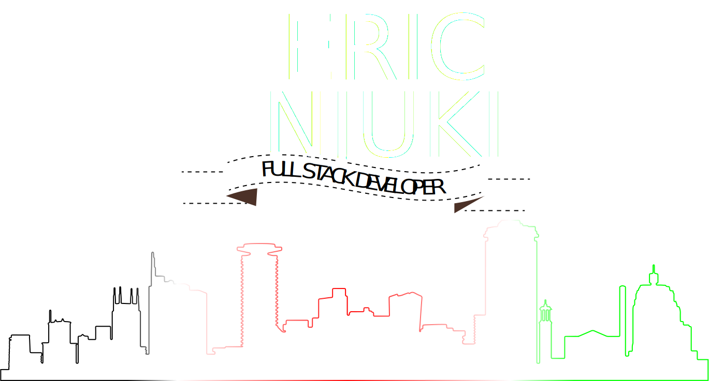

<!-- 
- 👋 Hi, I’m @ericnjuki
- 👀 I’m interested in ...
- 🌱 I’m currently learning ...
- 💞️ I’m looking to collaborate on ...
- 📫 How to reach me ...
 -->

 

Hello 👋

I’m Eric, a full-stack engineer.

If you'd like to know more about me, [check out my portfolio.](https://ericnjuki.com)

<!---
ericnjuki/ericnjuki is a ✨ special ✨ repository because its `README.md` (this file) appears on your GitHub profile.
You can click the Preview link to take a look at your changes.
--->
