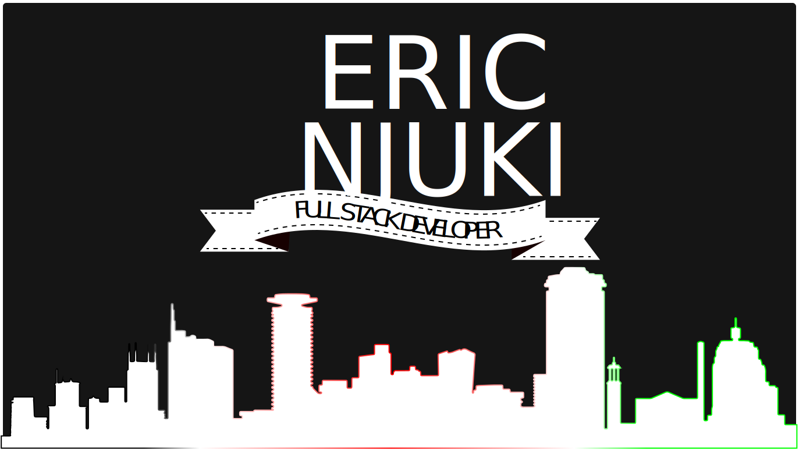

<!-- 
- 👀 I’m interested in ...
- 🌱 I’m currently learning ...
- 💞️ I’m looking to collaborate on ...
- 📫 How to reach me ...
 -->

<pre style="text-align: center;">
Hello 👋

I’m Eric, a freelance full-stack web developer and honorary designer.
I'm currently learning Vue.js.
You can reach me via twitter @ericnjuki
or email me at contact at ericnjuki dot com
<a href="https://ericnjuki.com">Check out the kind of work I do</a>
</pre>

 

## Skills

 

## Top Projects

These are full apps I worked on in Angular + C#

 &nbsp;&nbsp;&nbsp;

 &nbsp;&nbsp;&nbsp;

 

## Learning Tracker
Inspired by 
[Syknapse](https://github.com/Syknapse/My-Learning-Tracker)

[//]: # (Status images)

[Completed]: https://user-images.githubusercontent.com/29199184/32275438-8385f5c0-bf0b-11e7-9406-42265f71e2bd.png "Completed"
[In Progress]: https://user-images.githubusercontent.com/29199184/34462881-7305ddac-ee4d-11e7-9b57-589424820da4.png "In Progress"
[Soon]: https://user-images.githubusercontent.com/29199184/34462916-d5c37bd4-ee4d-11e7-9f4a-d57f2243281b.png "Soon"
[done]: https://user-images.githubusercontent.com/29199184/32275438-8385f5c0-bf0b-11e7-9406-42265f71e2bd.png "Done"

### Skills
|               Skill              | Introduction | Used in a project    | Professional Use |
|:-------------------------------- |:-----------------:|:----------------------:|:----------------:|
|**C#**                         | ![done][done]     | ![done][done]          | ![done][done]    |
|**Vue**                        | ![done][done]     | ![done][done]          | ![done][done]    |
|**SQL**                        | ![done][done]     | ![done][done]          | ![done][done]    |
[see all](https://github.com/ericnjuki/my-learning-tracker)..

### Learning
|            Status           |   Year     |                            Course                               |                   Tutor                     |
|:---------------------------:|:-----------|:----------------------------------------------------------------|:-------------------------------------------:|
| ![In Progress][In Progress] | Jan 2022   | [Vue - The Complete Guide]                                      | Maximilian Schwarzmüller                    |
| ![Completed][Completed]     | Apr 2017   | [Angular - The Complete Guide]                                  | Maximilian Schwarzmüller                    |
| ![Completed][Completed]     | July 2021  | [Learn CSS Grid for free]                                       | Per Harald Borgen - [Scrimba]               |
| ![Soon][Soon]               |            | Read [You Don't Know JS Yet: Get Started - 2nd Edition]         | Kyle Simpson                                |
[see all](https://github.com/ericnjuki/my-learning-tracker)..

[//]: # (Reference links to courses)

[Vue - The Complete Guide]: https://www.udemy.com/course/vuejs-2-the-complete-guide/
[Angular - The Complete Guide]: https://www.udemy.com/course/the-complete-guide-to-angular-2/
[You Don't Know JS Yet: Get Started - 2nd Edition]: https://github.com/getify/You-Dont-Know-JS/blob/2nd-ed/get-started/README.md
[Learn CSS Grid for free]: https://scrimba.com/learn/cssgrid

[Scrimba]: https://scrimba.com/
View all my learning progress in my [learning tracker](https://github.com/ericnjuki/my-learning-tracker).

 

## Experiments

Projects I worked on to experiment with technologies I don't often use

 &nbsp;&nbsp;&nbsp;

 &nbsp;&nbsp;&nbsp;

## Contact
<pre>
You may reach me through twitter by dropping a quick DM (open DMs)
or via email (contact at ericnjuki dot com)
</pre>

<!-- 
REPOS HTML VERSIONS

 

 

 

 

 

 
 
 

-->

<!-- 
REPOS MARKDOWN VERSIONS
 

 

 

 
 
 

 

 
-->

<!---
ericnjuki/ericnjuki is a ✨ special ✨ repository because its `README.md` (this file) appears on your GitHub profile.
You can click the Preview link to take a look at your changes.
--->
