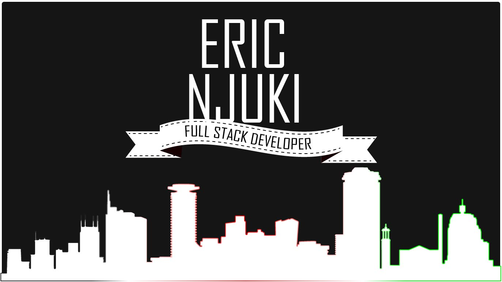

<!-- 
- 👀 I’m interested in ...
- 🌱 I’m currently learning ...
- 💞️ I’m looking to collaborate on ...
- 📫 How to reach me ...
 -->

<!-- 

 -->

<pre style="text-align: center;">
Hello 👋

I’m Eric, a full-stack web developer and honorary designer.
I'm currently learning Node.js.
You can reach me via twitter <a href="https://twitter.com/ericnjuki">@ericnjuki</a> or <a href="mailto:contact@ericnjuki.com">email</a>.
<a href="https://ericnjuki.com">Check out my work</a>
</pre>

 

## Skills

<!--  -->

<!--  -->
<!--  -->
<!--  -->
<!--  -->
<!--  -->

 

## Top Projects

These are full apps I worked on in Angular + C#

 &nbsp;&nbsp;&nbsp;

 &nbsp;&nbsp;&nbsp;

 

## Learning Tracker
Inspired by 
[Syknapse](https://github.com/Syknapse/My-Learning-Tracker)

[//]: # (Status images)

[Completed]: https://user-images.githubusercontent.com/29199184/32275438-8385f5c0-bf0b-11e7-9406-42265f71e2bd.png "Completed"
[In Progress]: https://user-images.githubusercontent.com/29199184/34462881-7305ddac-ee4d-11e7-9b57-589424820da4.png "In Progress"
[Soon]: https://user-images.githubusercontent.com/29199184/34462916-d5c37bd4-ee4d-11e7-9f4a-d57f2243281b.png "Soon"
[done]: https://user-images.githubusercontent.com/29199184/32275438-8385f5c0-bf0b-11e7-9406-42265f71e2bd.png "Done"

### Skills
|               Skill              |    Introduction   |     Regular Use        | Professional Use |
|:-------------------------------- |:-----------------:|:----------------------:|:----------------:|
|**JavaScript**                    | ![done][done]     | ![done][done]          | ![done][done]    |
|**C#**                            | ![done][done]     | ![done][done]          | ![done][done]    |
|**.NET Framework**                | ![done][done]     | ![done][done]          | ![done][done]    |
|**Angular**                       | ![done][done]     | ![done][done]          | ![done][done]    |
|**SQL Server**                    | ![done][done]     | ![done][done]          | ![done][done]    |
[see all](https://github.com/ericnjuki/learning-tracker)..

### Learning
|            Progress         |   Type     | Course                                                          |   Date     |
|:---------------------------:|:----------:|:----------------------------------------------------------------|:-----------|
| ![In Progress][In Progress] |   Course   | [Learn Node.js]                                                 |            |
| ![Completed][Completed]     |   Course   | [Learn CSS Grid for free]                                       |  July 2021 |
| ![Completed][Completed]     |   Course   | [Angular - The Complete Guide]                                  |  Apr 2017  |
| ![Soon][Soon]               |    Book    | Read [You Don't Know JS Yet: Get Started - 2nd Edition]         |            |
[see all](https://github.com/ericnjuki/learning-tracker)..

[//]: # (Reference links to courses)

[Learn Node.js]: https://nodejs.dev/learn
[Angular - The Complete Guide]: https://www.udemy.com/course/the-complete-guide-to-angular-2/
[You Don't Know JS Yet: Get Started - 2nd Edition]: https://github.com/getify/You-Dont-Know-JS/blob/2nd-ed/get-started/README.md
[Learn CSS Grid for free]: https://scrimba.com/learn/cssgrid
[JavaScript30]: https://javascript30.com/
[Startup School]: https://www.startupschool.org/
View all my learning progress in my [learning tracker](https://github.com/ericnjuki/learning-tracker).

 

## Experiments

Projects I worked on to experiment with technologies I don't often use

 &nbsp;&nbsp;&nbsp;

 &nbsp;&nbsp;&nbsp;

<!-- 
REPOS HTML VERSIONS

 

 

 

 

 

 
 
 

-->

<!-- 
REPOS MARKDOWN VERSIONS
 

 

 

 
 
 

 

 
-->
